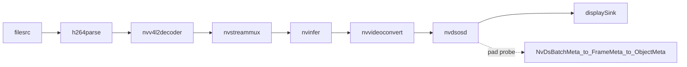

# Pipeline Flow

File gốc `../../deepstream-test1.py` dùng một pipeline rất "kinh điển" để học
DeepStream:

`filesrc -> h264parse -> nvv4l2decoder -> nvstreammux -> nvinfer -> nvvideoconvert -> nvdsosd -> sink`

## Nhìn toàn cục

## Vai trò từng plugin

### `filesrc`

- Đọc byte từ file trên đĩa.
- Chưa hiểu nội dung video; nó chỉ biết lấy dữ liệu từ file.

### `h264parse`

- Chuẩn hóa luồng H264 trước khi đưa vào decoder.
- Đây là lý do trong file gốc phải có parser trước `nvv4l2decoder`.

### `nvv4l2decoder`

- Dùng hardware decoder của NVIDIA để giải mã video.
- Sau điểm này, dữ liệu không còn là luồng H264 nén nữa, mà là frame video.

### `nvstreammux`

Theo docs DeepStream, `nvstreammux` dùng để tạo một batched buffer từ một hoặc
nhiều source. Kể cả khi `batch-size=1`, nó vẫn là điểm vào chuẩn cho nhiều
plugin DeepStream phía sau.

Điều quan trong can nhớ:
- Đây là request-pad based element.
- Bạn phải xin `sink_0`, `sink_1`, ... rồi mới link source vao.
- `batch-size` là số frame tối đa trong một batch.
- `batched-push-timeout` quyết định chờ bao lâu trước khi đẩy batch xuống dưới.
- `width` và `height` xác định kích thước output mà muxer đưa ra.

### `nvinfer`

Theo docs DeepStream, `nvinfer` là plugin dùng TensorRT để chạy suy luận. Plugin
nay đọc file config qua property `config-file-path`.

Nó là một mốc rất quan trọng:
- Code pipeline không hard-code model chi tiết.
- File config quyết định model nào, labels nao, engine nào, clustering nao.
- Sau khi suy luận, metadata được gắn vào buffer.

### `nvvideoconvert`

- Chuyển đổi định dạng pixel / bộ nhớ để plugin sau dung được.
- Trong file gốc, nó đưa dữ liệu về dạng hợp voi `nvdsosd`.

### `nvdsosd`

- Dùng để vẽ bbox, text, overlay lên frame.
- Đây cũng là vị trí hợp lý để gắn pad probe và đọc metadata đã được suy luận.

### `sink`

- Hiển thị kết quả ra màn hình.
- File gốc chọn sink tùy theo nền tảng GPU.

## Tại sao probe đặt ở `nvosd.sink`?

Vì tại điểm do:
- Frame đã qua `nvinfer`.
- Metadata detection da được gắn vào buffer.
- Chưa qua OSD nên bạn có the đọc metadata và quyết định sẽ vẽ gì.

Đó là lý do file gốc lam:
- `osdsinkpad = nvosd.get_static_pad("sink")`
- `osdsinkpad.add_probe(...)`

## Khác nhau giữa static pad và request pad

### Static pad

- Là pad có sẵn trên element.
- Ví dụ: `decoder.get_static_pad("src")`, `nvosd.get_static_pad("sink")`.

### Request pad

- Là pad phải xin từ element khi cần.
- Ví dụ: `streammux.request_pad_simple("sink_0")`.
- Kiểu này hợp với bài toán có số source thay đổi theo runtime.

## Pipeline lifecycle trong file gốc

1. `Gst.init(None)`
2. Tao element bang `Gst.ElementFactory.make(...)`
3. `pipeline.add(...)`
4. `link(...)` và request pad cho muxer
5. Tao `GLib.MainLoop()`
6. Nối `bus_call` vào bus
7. Gan probe
8. `pipeline.set_state(Gst.State.PLAYING)`
9. `loop.run()`
10. Kết thúc thì `pipeline.set_state(Gst.State.NULL)`

## `# TODO`

- Giải thích bằng lời của bạn du lieu dang o dạng nào ngay trước và ngay sau
  `nvv4l2decoder`.
- Giải thích vì sao `nvstreammux` không phải chỉ dành cho multi-source.
- Thử vẽ lại sơ đồ pipeline mà không nhìn file.
- Gạch chân plugin nào "tạo metadata mới" trong pipeline này.

## SELF-CHECK

- Nếu bỏ `nvinfer`, probe còn đọc được `NvDsObjectMeta` không? Vì sao?
- Nếu có 2 source, bạn sẽ phải xin thêm pad nào tren `nvstreammux`?
- `width` và `height` của muxer ảnh hưởng đến đầu ra như the nao?
