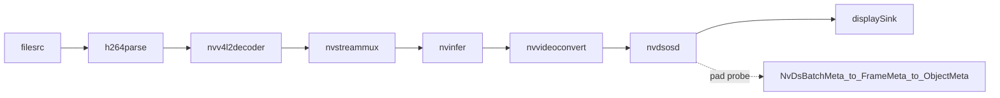

# Pipeline Flow

File goc `../../deepstream-test1.py` dung mot pipeline rat "kinh dien" de hoc
DeepStream:

`filesrc -> h264parse -> nvv4l2decoder -> nvstreammux -> nvinfer -> nvvideoconvert -> nvdsosd -> sink`

## Nhin toan cuc

## Vai tro tung plugin

### `filesrc`

- Doc byte tu file tren dia.
- Chua hieu noi dung video; no chi biet lay du lieu tu file.

### `h264parse`

- Chuan hoa luong H264 truoc khi dua vao decoder.
- Day la ly do trong file goc phai co parser truoc `nvv4l2decoder`.

### `nvv4l2decoder`

- Dung hardware decoder cua NVIDIA de giai ma video.
- Sau diem nay, du lieu khong con la luong H264 nen nua, ma la frame video.

### `nvstreammux`

Theo docs DeepStream, `nvstreammux` dung de tao mot batched buffer tu mot hoac
nhieu source. Kể ca khi `batch-size=1`, no van la diem vao chuan cho nhieu
plugin DeepStream phia sau.

Dieu quan trong can nho:
- Day la request-pad based element.
- Ban phai xin `sink_0`, `sink_1`, ... roi moi link source vao.
- `batch-size` la so frame toi da trong mot batch.
- `batched-push-timeout` quyet dinh cho bao lau truoc khi day batch xuong duoi.
- `width` va `height` xac dinh kich thuoc output ma muxer dua ra.

### `nvinfer`

Theo docs DeepStream, `nvinfer` la plugin dung TensorRT de chay suy luan. Plugin
nay doc file config qua property `config-file-path`.

No la mot moc rat quan trong:
- Code pipeline khong hard-code model chi tiet.
- File config quyet dinh model nao, labels nao, engine nao, clustering nao.
- Sau khi suy luan, metadata duoc gan vao buffer.

### `nvvideoconvert`

- Chuyen doi dinh dang pixel / bo nho de plugin sau dung duoc.
- Trong file goc, no dua du lieu ve dang hop voi `nvdsosd`.

### `nvdsosd`

- Dung de ve bbox, text, overlay len frame.
- Day cung la vi tri hop ly de gan pad probe va doc metadata da duoc suy luan.

### `sink`

- Hien thi ket qua ra man hinh.
- File goc chon sink tuy theo nen tang GPU.

## Tai sao probe dat o `nvosd.sink`?

Vi tai diem do:
- Frame da qua `nvinfer`.
- Metadata detection da duoc gan vao buffer.
- Chua qua OSD nen ban co the doc metadata va quyet dinh se ve gi.

Do la ly do file goc lam:
- `osdsinkpad = nvosd.get_static_pad("sink")`
- `osdsinkpad.add_probe(...)`

## Khac nhau giua static pad va request pad

### Static pad

- La pad co san tren element.
- Vi du: `decoder.get_static_pad("src")`, `nvosd.get_static_pad("sink")`.

### Request pad

- La pad phai xin tu element khi can.
- Vi du: `streammux.request_pad_simple("sink_0")`.
- Kieu nay hop voi bai toan co so source thay doi theo runtime.

## Pipeline lifecycle trong file goc

1. `Gst.init(None)`
2. Tao element bang `Gst.ElementFactory.make(...)`
3. `pipeline.add(...)`
4. `link(...)` va request pad cho muxer
5. Tao `GLib.MainLoop()`
6. Noi `bus_call` vao bus
7. Gan probe
8. `pipeline.set_state(Gst.State.PLAYING)`
9. `loop.run()`
10. Ket thuc thi `pipeline.set_state(Gst.State.NULL)`

## `# TODO`

- Giai thich bang loi cua ban du lieu dang o dang nao ngay truoc va ngay sau
  `nvv4l2decoder`.
- Giai thich vi sao `nvstreammux` khong phai chi danh cho multi-source.
- Thu ve lai so do pipeline ma khong nhin file.
- Gach chan plugin nao "tao metadata moi" trong pipeline nay.

## SELF-CHECK

- Neu bo `nvinfer`, probe con doc duoc `NvDsObjectMeta` khong? Vi sao?
- Neu co 2 source, ban se phai xin them pad nao tren `nvstreammux`?
- `width` va `height` cua muxer anh huong den dau ra nhu the nao?
